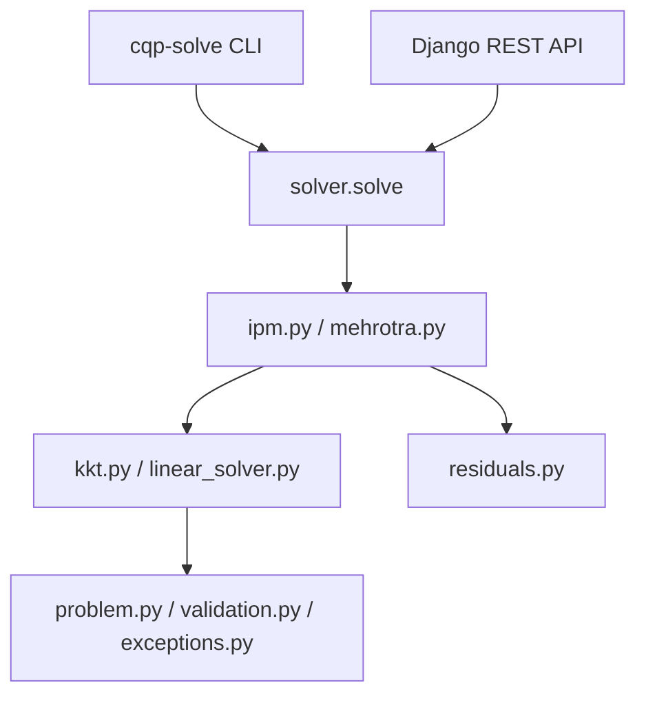

# Convex Quadratic Programming Solver


A research-oriented Python implementation of a **primal-dual interior-point solver**
for **convex quadratic programming**, with a Django REST API.

## Status

| Metric | Value |
| --- | --- |
| Version | v0.1.0 |
| Tests | 79 passing |
| Coverage (solver) | 96% |
| Lint / Format | ruff clean |
| Type check | mypy strict (solver, validation) |
| References | OSQP and Clarabel agreement |

## Problem

Minimize

$$
\min_{x \in \mathbb{R}^n} \; \frac{1}{2} x^T P x + q^T x
\quad \text{s.t.} \quad A x = b, \; G x \le h,
$$

where $P \succeq 0$ (symmetric positive semidefinite), $A \in \mathbb{R}^{m \times n}$,
$G \in \mathbb{R}^{p \times n}$.

## Method

- Primal-dual interior-point with a **Mehrotra predictor-corrector** step.
- Reduced KKT system solved via dense (NumPy) or sparse (SciPy SuperLU) factorization.
- Fraction-to-boundary step length and adaptive centering parameter.

## Features

- Standard convex QP formulation with equality and inequality constraints.
- Primal-dual interior-point (basic) and Mehrotra predictor-corrector.
- KKT residual diagnostics: stationarity, primal feasibility, complementarity, duality gap.
- Dense and sparse KKT paths (scipy.sparse.linalg.splu / SuperLU).
- Input validation: shapes, symmetry, positive semidefiniteness, finiteness.
- Heuristic detection of infeasible and unbounded problems.
- Property-based tests (Hypothesis) and numerical validation corpus (100+ problems).
- Reference comparison against OSQP and Clarabel.
- CLI: cqp-solve problem.json.
- Django REST API with OpenAPI/Swagger.


## Installation

```powershell
python -m venv .venv
.\.venv\Scripts\Activate.ps1
pip install -e ".[dev]"
```

## Quick Start

```python
import numpy as np
from solver import QPProblem, solve

problem = QPProblem(
    P=np.eye(2),
    q=np.array([-2.0, -3.0]),
    A=np.zeros((0, 2)), b=np.zeros(0),
    G=np.array([[1.0, 1.0]]), h=np.array([2.0]),
)
result = solve(problem)
print(result.status, result.x, result.objective)
```

## CLI

```powershell
cqp-solve examples\halfplane.json
```

## REST API

```powershell
cd api
python manage.py migrate
python manage.py runserver
```

- GET  /api/v1/health/      liveness probe
- GET  /api/v1/version/     solver version
- GET  /api/v1/examples/    example payloads
- POST /api/v1/solve/qp/    solve a convex QP
- GET  /api/docs/           Swagger UI
- GET  /api/schema/         OpenAPI schema

## Testing

```powershell
pytest
ruff check .
ruff format --check .
mypy .
```

## Benchmarks

```powershell
python -m benchmarks.run
python -m benchmarks.compare_reference
```

Results are written to benchmarks/results/.

## Project Structure

```text
solver/        optimization core (problem, validation, KKT, IPM, Mehrotra, diagnostics, CLI)
validation/    analytical examples and random QP generators
benchmarks/    size-scaling and reference-comparison harness
examples/      portfolio, resource allocation, SVM dual, MPC
api/           Django REST API (adapter layer)
docs/          mathematical and numerical documentation
tests/         unit, integration, property-based, and API tests
```

## Documentation

- docs/mathematical-formulation.md
- docs/kkt-conditions.md
- docs/interior-point-method.md
- docs/mehrotra-algorithm.md
- docs/numerical-methods.md
- docs/validation.md
- docs/benchmarks.md
- docs/benchmark-report.md
- docs/architecture.md
- docs/audit.md
- docs/limitations.md

## License

MIT. See LICENSE.


## Architecture



